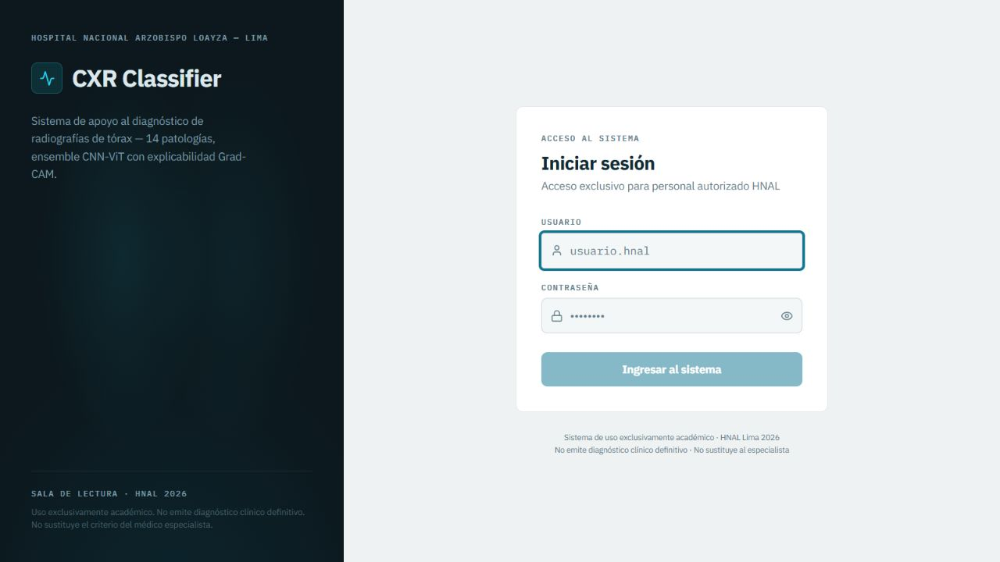
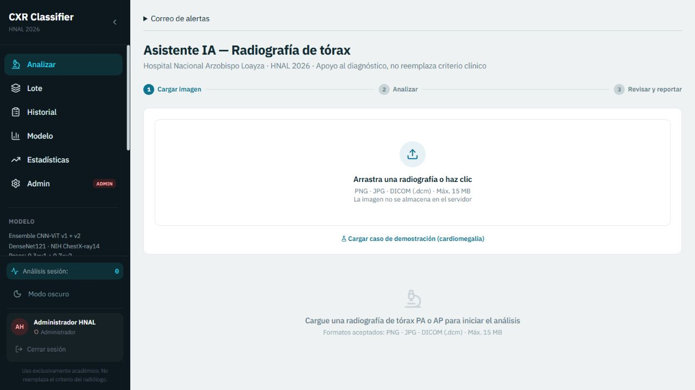
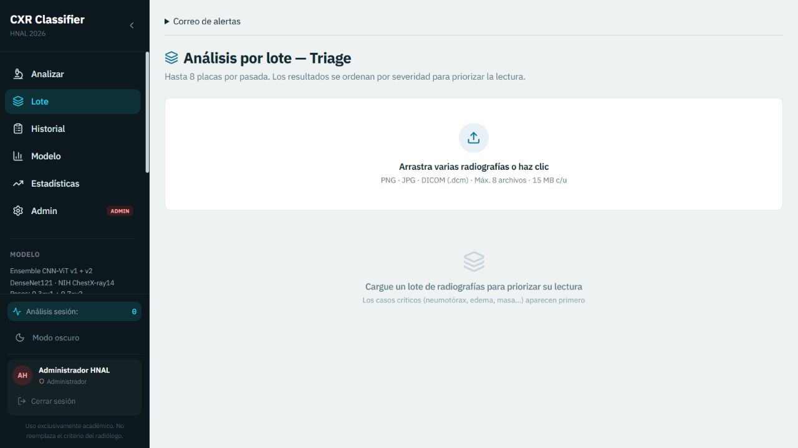
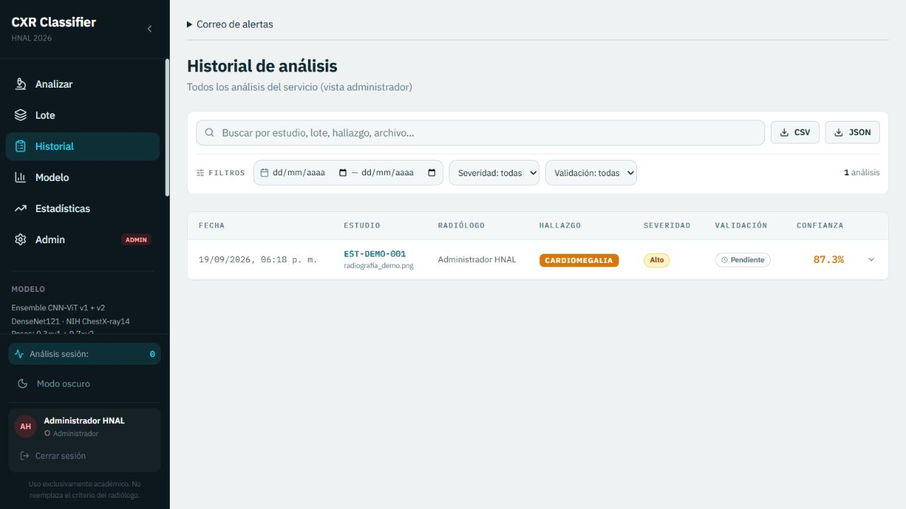
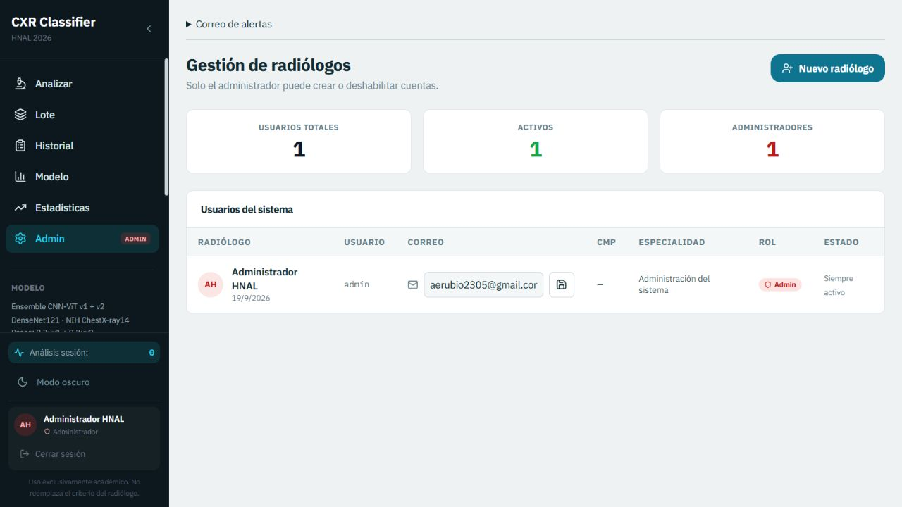

# Manual de usuario - CXR Classifier

**Sistema académico de apoyo al análisis de radiografías de tórax**

Hospital Nacional Arzobispo Loayza - HNAL, Lima, Perú

Versión del manual: 1.0 - septiembre de 2026

> CXR Classifier no emite un diagnóstico definitivo ni reemplaza el criterio del
> radiólogo. Los resultados, probabilidades y mapas de calor deben revisarse junto
> con la imagen original, la historia clínica y los protocolos institucionales.

## 1. Alcance

El sistema procesa radiografías de tórax en PNG, JPG, JPEG o DICOM y estima de
forma independiente 14 hallazgos. También permite analizar lotes, consultar el
historial, registrar concordancia clínica y generar reportes PDF. Las imágenes y
los mapas de calor no se guardan en la base de datos.

Los roles disponibles son:

- **Radiólogo:** análisis individual y por lote, historial propio, validación y consulta del modelo.
- **Administrador:** todas las funciones anteriores, gestión de usuarios y estadísticas globales.

## 2. Acceso y cierre de sesión

1. Abra la URL institucional del sistema.
2. Ingrese el usuario y la contraseña asignados por el administrador.
3. Seleccione **Ingresar al sistema**.
4. Para terminar, use **Cerrar sesión** en la parte inferior del menú.

Una cuenta desactivada pierde acceso en su siguiente navegación o solicitud,
aunque hubiera iniciado sesión anteriormente. Si esto ocurre, el sistema vuelve
a la pantalla de acceso.

## 3. Análisis individual

1. Abra **Analizar**.
2. Registre el ID de estudio y los datos no identificantes disponibles.
3. Arrastre la imagen o selecciónela desde el equipo.
4. Verifique la previsualización, formato y tamaño.
5. Seleccione el método de mapa de calor: Grad-CAM, Grad-CAM++ o Score-CAM.
6. Presione **Analizar radiografía** y espere a que finalicen las etapas.

El archivo debe cumplir estas reglas:

- Formato PNG, JPG, JPEG o DICOM.
- Tamaño máximo configurado, normalmente 15 MB.
- Dimensiones entre 64 x 64 y 8192 x 8192 píxeles.
- Contenido decodificable y número de canales compatible.

## 4. Interpretación de resultados

La pantalla de resultados presenta:

- Hallazgo principal y confianza estimada.
- Hallazgos positivos que superan su umbral por clase.
- Hallazgos cercanos al umbral para revisión.
- Las 14 probabilidades ordenadas.
- Severidad operativa para priorización.
- Advertencias de calidad de imagen.
- Explicación, recomendaciones y descargo académico.

Una misma radiografía puede tener varios hallazgos positivos porque el modelo es
multi-etiqueta. **No Finding** significa que ninguna clase superó su umbral; no
demuestra por sí solo la ausencia de enfermedad.

### Mapa de calor

El mapa indica regiones que influyeron en la puntuación seleccionada. Puede cambiar
la clase explicada, el método y la opacidad. Cambiar solamente la opacidad no ejecuta
otra inferencia. El mapa no es una segmentación anatómica ni confirma una lesión.

### Reporte PDF

Use **Descargar PDF** para generar un resumen con estudio, responsable, resultados,
versión del modelo y advertencia de alcance. Desde el historial también puede regenerar
un PDF, pero sin imagen ni mapa de calor porque esos elementos no se almacenan.

## 5. Análisis por lote

1. Abra **Lote**.
2. Añada hasta ocho imágenes.
3. Retire cualquier archivo incorrecto antes de comenzar.
4. Inicie el análisis.
5. Revise los resultados ordenados por severidad, con los posibles críticos primero.

Cada resultado exitoso se registra con un mismo ID de lote. Un error en un archivo no
debe cancelar los demás elementos del lote.

## 6. Historial y validación clínica

Abra **Historial** para consultar análisis anteriores. El radiólogo ve sus propios
estudios; el administrador puede revisar todos.

Puede:

- Buscar por estudio, lote, archivo, hallazgo o responsable.
- Filtrar por severidad, validación, fecha y radiólogo cuando corresponda.
- Expandir un registro para consultar probabilidades y trazabilidad.
- Marcar concordancia con el modelo.
- Registrar discrepancia, hallazgo real y comentario.
- Exportar los resultados visibles en CSV o JSON.
- Regenerar el reporte PDF.

No use nombres, documentos de identidad ni otros datos personales en los campos libres.

## 7. Modelo y comparación

La sección **Modelo** muestra arquitectura, versión, clases, umbrales y métricas AUC.
La sección de comparación permite contrastar resultados disponibles. Las probabilidades
son estimaciones del modelo y no equivalen a certeza diagnóstica.

## 8. Administración

Solo el administrador puede abrir **Admin** y **Estadísticas**.

En **Gestión de radiólogos** puede:

- Crear una cuenta con nombre, usuario, contraseña, CMP y especialidad.
- Editar los datos permitidos.
- Activar o desactivar una cuenta.
- Revisar el total de cuentas activas.

Al desactivar una cuenta se bloquean nuevos accesos y las sesiones abiertas dejan de
autorizar solicitudes. No comparta contraseñas ni reutilice credenciales personales.

En **Estadísticas** puede revisar volumen diario, severidad, hallazgos, actividad y
concordancia clínica, aplicando filtros por fecha.

## 9. Privacidad y trazabilidad

- La base de datos no conserva la radiografía ni el mapa de calor.
- DICOM aporta únicamente edad, sexo, proyección y un hash del StudyInstanceUID cuando existen.
- No se leen ni guardan nombre, identificador ni fechas del paciente.
- Cada análisis conserva responsable, versión del modelo, tiempo, scores y hash de imagen.
- La auditoría registra eventos sin bytes de imagen ni identidad del paciente.

## 10. Solución de problemas

| Situación | Acción recomendada |
|---|---|
| Credenciales rechazadas | Verifique mayúsculas y solicite al administrador confirmar que la cuenta está activa. |
| Archivo rechazado | Compruebe formato, tamaño, dimensiones y que el archivo no esté corrupto. |
| Backend no disponible | Espere y reintente; si persiste, comunique la hora y el mensaje al responsable técnico. |
| Resultado sin mapa | Reintente con Grad-CAM o revise si la respuesta informó un error de explicabilidad. |
| Sesión cerrada inesperadamente | La cuenta pudo ser desactivada o la sesión alcanzó su duración máxima. |
| PDF sin imagen desde historial | Es el comportamiento esperado: las imágenes no se almacenan por privacidad. |

## 11. Flujo recomendado para demostración

1. Iniciar sesión con una cuenta de prueba autorizada.
2. Cargar una radiografía desidentificada.
3. Revisar hallazgo principal, probabilidades y advertencias.
4. Cambiar clase, método y opacidad del mapa de calor.
5. Descargar el PDF.
6. Abrir el historial y registrar concordancia o discrepancia.
7. Mostrar el procesamiento por lote y su priorización.
8. Con una cuenta administradora, revisar estadísticas y usuarios.

## 12. Referencia técnica

La instalación, arquitectura, endpoints, variables de entorno, pruebas y despliegue se
documentan en el [`README.md`](../README.md). Las limitaciones principales son el carácter
académico del sistema, la dependencia de la calidad de entrada y la ausencia actual de un
clasificador dedicado para distinguir radiografías de tórax de otras modalidades.
